# Taller: Volúmenes y Bind Mounts en Docker

## Ejercicio 1 — Bind mount en modo lectura con Nginx 

1. **Crear una carpeta y un archivo**
    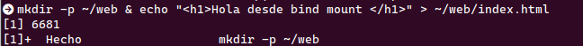

2. **Levantar Nginx con bind mount de solo lectura**
    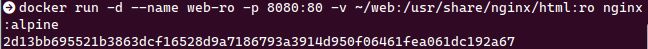

3. **Abrir `http://localhost:8080` y verificar**
    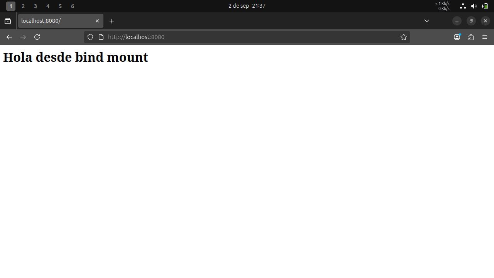

4. **Editar index.html en el host y recargar el navegador**
    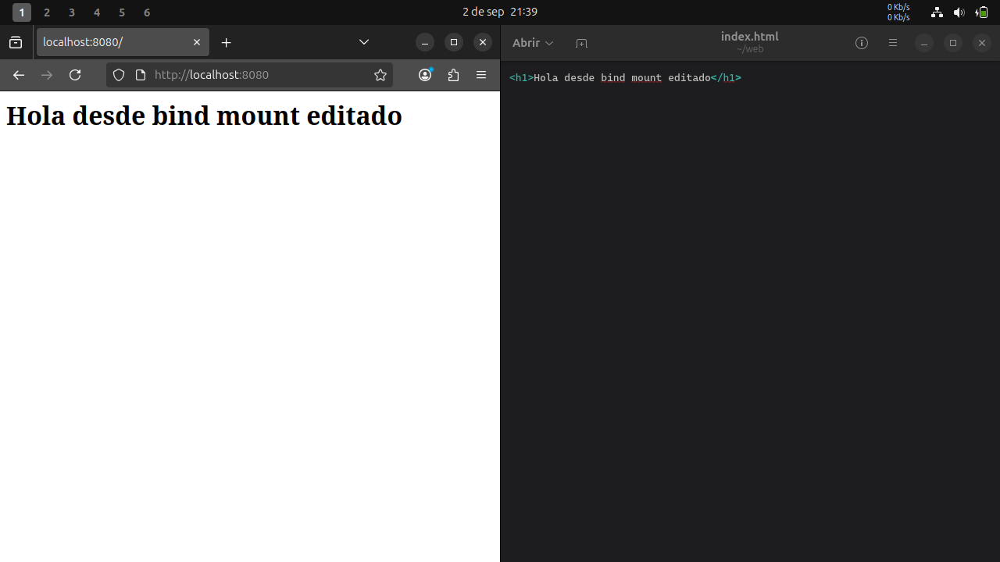

5. **Intentar crear un archivo dentro del contenedor**
    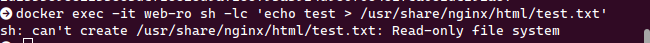

---

## Ejercicio 2 — Named volume con PostgreSQL

1. **Crear un volumen**
    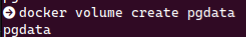

2. **Ejecutar PostgreSQL**
    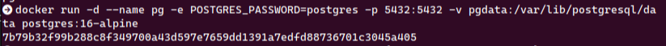

3. **Crear tabla y agregar datos**
    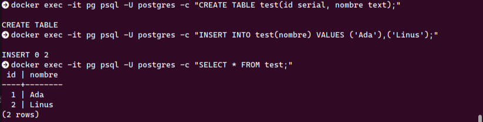

4. **Eliminar el contenedor**
    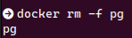

5. **Volver a levantarlo usando el mismo volumen y verificar los datos**
    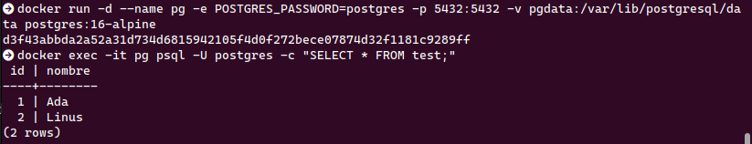

---

## Ejercicio 3 — Volumen compartido entre dos contenedores

1. **Crear volumen**
    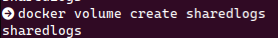

2. **Productor (escribe timestamps cada segundo)**
    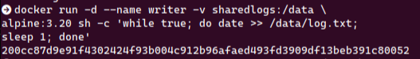

3. **Consumidor (lee en tiempo real)**
    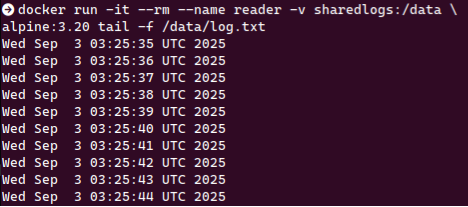

4. **Reiniciar el productor y revisar que el archivo sigue creciendo**
    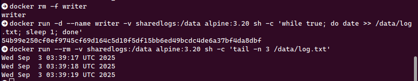

---

## Ejercicio 4 — Backup y restauración de un volumen

1. **Crear volumen y añadir un archivo**
    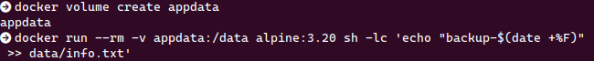

2. **Hacer backup a un tar en el host**
    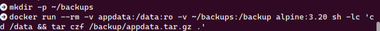

3. **Restaurar en un nuevo volumen**
    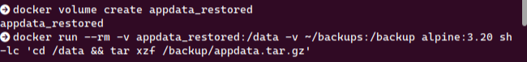

4. **Verificar el contenido restaurado**
    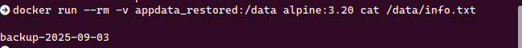

---

## Reflexión

- **Ejercicio 1:** Se entiende el funcionamiento del Bind mount, observando la relación entre el host y el contenedor.
- **Ejercicio 2:** Se comprueba la persistencia de datos al usar volúmenes con PostgreSQL.
- **Ejercicio 3:** Se verifica que distintos contenedores pueden usar un mismo volumen simultáneamente. Surgió el problema de no poder detener el proceso del consumidor con `Ctrl+C`, que se resuelve usando la flag `--init`. 
- **Ejercicio 4:** Se logra realizar un backup y restauración de datos de un volumen con éxito. 

